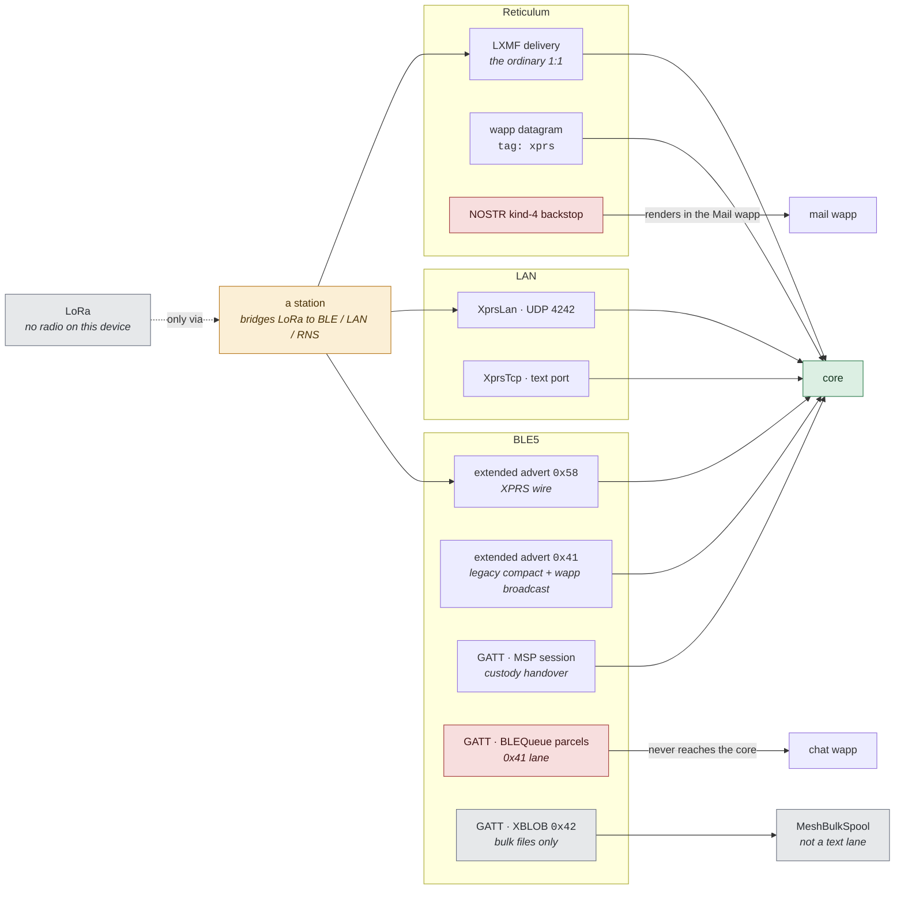
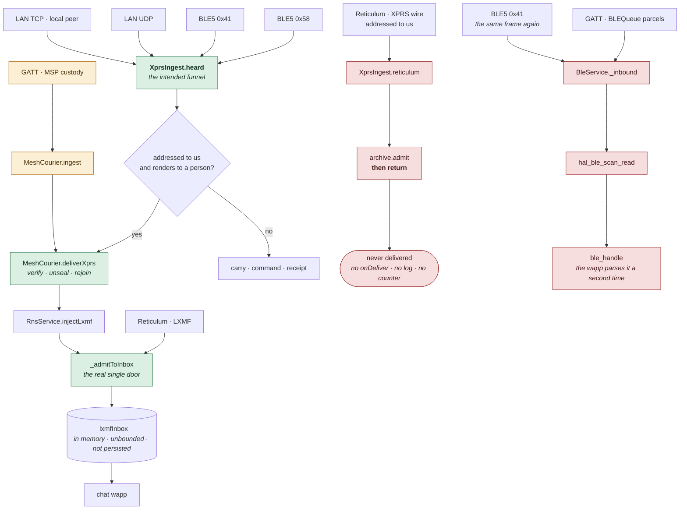
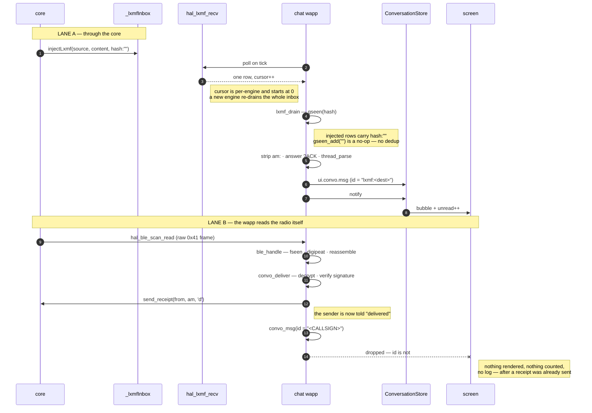
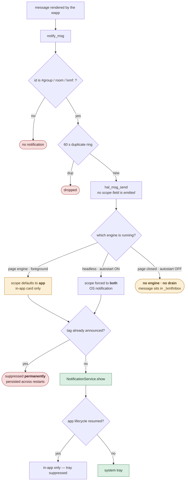
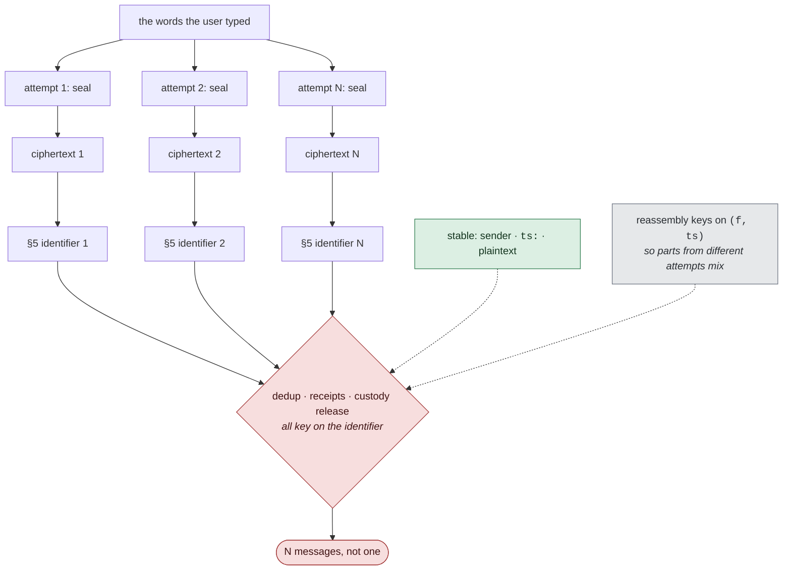
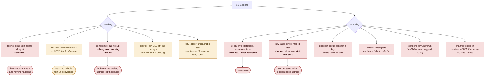

# Receiving a 1:1 — from the air to the bubble

What this is for: to answer *where did the message go* without a debugger. Every
bearer a 1:1 can arrive on, the core it is supposed to converge in, the handoff
into the chat wapp, the point a notification is raised, and the last gate before
a bubble appears.

[transports-flow.md](transports-flow.md) draws the same territory as far as the
funnel and stops at *"deliver — verify · unseal · inbox"* (its Fig. 5). **This
document is the half after the inbox**, plus the lanes that never reach the
funnel at all.

Drawn against the tree on **2026-09-01**, and every figure is annotated with
what the code does rather than what the design intends. Where the two disagree
the box is red and the disagreement is named — those are collected, ranked and
costed in [../message-receive.md](../message-receive.md).

---

## Fig. 1 — Every way a 1:1 can arrive

The four inputs, drawn honestly: **LoRa is not a lane on this device.**
`LoraConnection.status` returns `unavailable` unconditionally
(`lib/connections/lora/lora_connection.dart`) and there is no KISS/serial
Reticulum interface in either repo, so LoRa reaches a phone only re-aired by a
station and enters as one of the other three. `lora` survives downstream as a
*label* on a peer's `link:` claim, nothing more.

> **LoRa gets a dotted line and no box of its own.** `diagrams/README.md`:
> anything not built gets no box, because drawing one says the opposite.

---

## Fig. 2 — The core is supposed to be the only door. It is not.

The rule: everything converges on the core, and the core hands finished text to
a wapp. Green is the rule working. **Red is a lane that reaches a person without
passing it.**

> **The Reticulum branch is the one to read twice.** An XPRS `t:message`
> addressed to this station that arrives over Reticulum is filed in the archive
> and returned from — `XprsIngest.reticulum`, `lib/services/xprs/xprs_ingest.dart`.
> It is never delivered, never rendered and never notified, and nothing counts
> it. Any peer whose bearer chose Reticulum can send you a message you will
> never see.
>
> **And the raw lane is a second door into the same screen.** Every `0x41`
> frame is handed to the funnel *and* pushed onto `BleService._inbound`, where
> the wapp parses it again with its own dedup, its own digipeat and its own
> receipt.

---

## Fig. 3 — Inbox to bubble: the half nobody had drawn

Two doors into one UI. Lane A is the core's; lane B is the wapp reading the
radio itself.

> **The tick that lies.** On lane B the wapp does the whole job — reassembly,
> decryption, signature check — emits its own `trc("delivered")`, **transmits a
> delivery receipt to the sender**, and only then reaches `convo_msg`, which
> returns because the conversation id is a bare callsign. The sender sees one
> tick. The recipient sees nothing at all.
>
> The filter is deliberate (`convo_msg` says so: the Mail wapp owns kind-4 1:1).
> The receipt sent before it is not.

---

## Fig. 4 — Where a notification fires, and where it cannot

> **Three ways a 1:1 arrives with no notification.** The wapp never emits a
> `scope`, so a message that arrives while the page is open is an in-app card
> and nothing else. With chat autostart off and the page closed there is no
> engine to drain the inbox, and **nothing in the core notifies on its own** —
> `NotificationService.show` is never called from `RnsService`, `MeshCourier`
> or `MeshCustody`. And the announced-tag guard is permanent and persisted:
> chat's tag is `chat:<convo>:<mid>` where `mid` derives from *sender + text*,
> so **the same person sending the same words again is never notified again.**
>
> Unread counts come from `ui.convo.msg`, not from `notify` — so a badge and a
> notification can disagree, and both can disagree with the thread.

---

## Fig. 5 — What stays the same about a message, and what does not

Everything downstream — dedup, receipts, custody release, reassembly — assumes
a message keeps one identity. Sealing is per attempt, so it does not.

**Measured on the bench, TANK2 `X1VCVM`, 2026-09-01** — the last 400 archived
packets:

| | |
|---|---|
| logical 1:1 messages | **40** |
| packets they produced | **394** |
| distinct §5 identifiers | **394** |
| `am:` correlation ids present | **0** |
| distinct ciphertexts for one message's part 1 | **up to 11** |

> A `t:receipt` names one identifier, so an ack releases one copy of thirty.
> The other twenty-nine stay parked and keep being re-aired, and every further
> retry mints more identifiers. `receipts.released: 1`, `purged: 1129`,
> `delivered: 351`, `sessionsAbrupt: 31` against `sessionsClean: 7`. **Custody
> cannot drain, so the store overflows, and the row cap sheds real mail.**
>
> This is why `transports-flow.md` Fig. 6 — `Aired → Arrived → Acked →
> Released` — does not describe the running system. It draws one identity for a
> whole life.

---

## Fig. 6 — Where a 1:1 dies

Every branch below discards a message the user believes was sent or received.
Red is silent: no log, no counter, nothing on screen.

> **The UI has three renderable states for eighteen real ones** — nothing, one
> tick, two ticks. Everything from *composed* through *on the air* is a single
> indistinguishable blank, which is why "did it send?" has never been
> answerable from the screen.

---

## What these figures do not show

The **send** path is drawn only where it explains a receive-side failure; it has
its own map in [transports-flow.md](transports-flow.md) Fig. 2 and prose in
[../private-messages.md](../private-messages.md). Groups and `#rooms` share most
of the inbound hops but diverge at the roster gate and carry no receipts.
Nothing here is a proposal — the findings and their ranking live in
[../message-receive.md](../message-receive.md).
