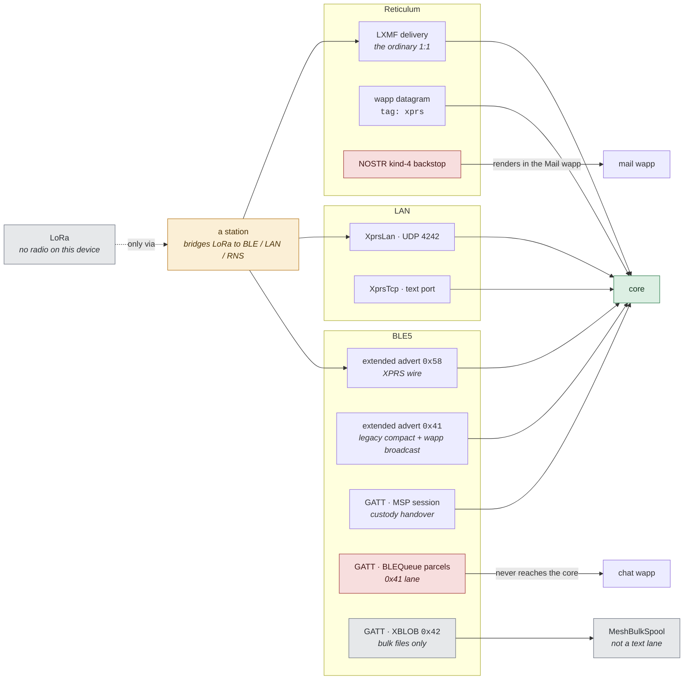
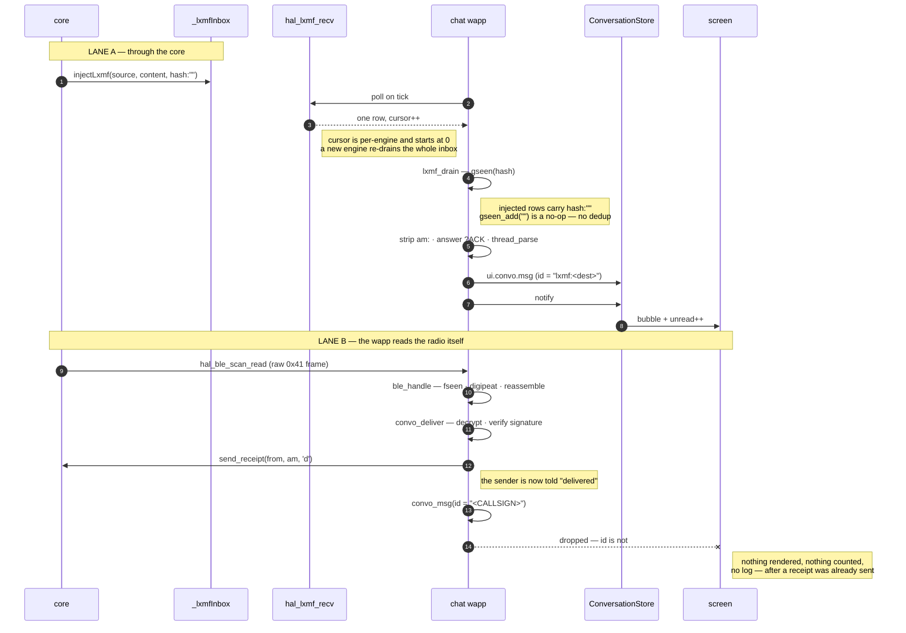
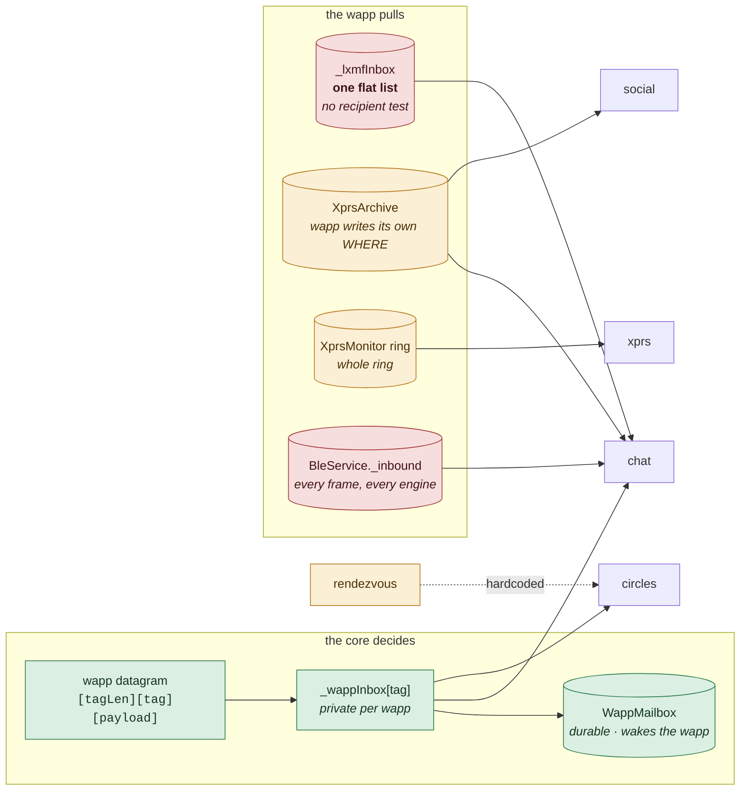
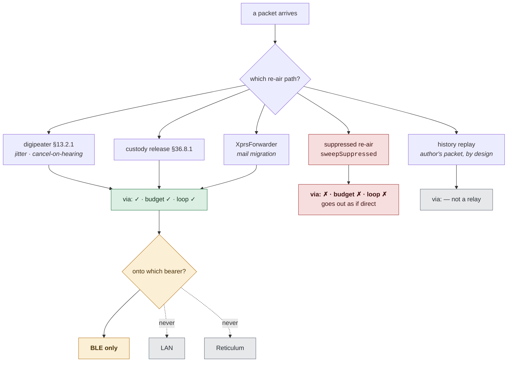
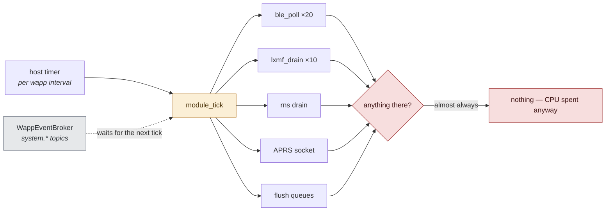

# Receiving a 1:1 — from the air to the bubble

What this is for: to answer *where did the message go* without a debugger. Every
bearer a 1:1 can arrive on, the core it is supposed to converge in, the handoff
into the chat wapp, the point a notification is raised, and the last gate before
a bubble appears.

[transports-flow.md](transports-flow.md) draws the same territory as far as the
funnel and stops at *"deliver — verify · unseal · inbox"* (its Fig. 5). **This
document is the half after the inbox**, plus the lanes that never reach the
funnel at all.

Drawn against the tree on **2026-09-01**, and every figure is annotated with
what the code does rather than what the design intends. Where the two disagree
the box is red and the disagreement is named — those are collected, ranked and
costed in [../message-receive.md](../message-receive.md).

---

## Fig. 1 — Every way a 1:1 can arrive

The four inputs, drawn honestly: **LoRa is not a lane on this device.**
`LoraConnection.status` returns `unavailable` unconditionally
(`lib/connections/lora/lora_connection.dart`) and there is no KISS/serial
Reticulum interface in either repo, so LoRa reaches a phone only re-aired by a
station and enters as one of the other three. `lora` survives downstream as a
*label* on a peer's `link:` claim, nothing more.

> **LoRa gets a dotted line and no box of its own.** `diagrams/README.md`:
> anything not built gets no box, because drawing one says the opposite.

---

## Fig. 2 — One door: every bearer through it, two lanes still around it

Audited 2026-09-02, re-checked after the gateway, the permission gate and the
Reticulum fix. **Green is through the door. Amber is fenced but still open.
Red is open and unfenced.**

```mermaid
flowchart TD
    subgraph THROUGH["through the door — every bearer that carries XPRS"]
        direction TB
        G["<b>PacketGateway</b><br/><i>demux · provenance · route by type</i>"]
        GATT["GATT — 4 roles"] --> G
        A58["BLE5 0x58 · 0x41 adverts"] --> G
        PARC["reassembled parcels"] --> G
        LANU["LAN UDP · TCP"] --> G
        RNS["Reticulum — LXMF router"] --> G
        DGX["Reticulum — <code>xprs</code> datagram tag"] --> G
        RV2["Reticulum — rendezvous"] --> G
        G --> FUN["XprsIngest · MeshCourier"]
        G --> BUS["event bus<br/><i>xprs.&lt;type&gt; · calls the wapp</i>"]
    end

    subgraph TEE["a copy, taken after the door"]
        direction TB
        RAW["hal_ble_scan_read<br/><code>transport.ble.raw</code>"]
    end

    subgraph PRIV["a wapp's own protocol — not XPRS"]
        direction TB
        DGRAM["hal_rns_recv — circles<br/><i>k:msg/ks/key… JSON</i>"]
        DM["hal_relay_dm_recv · nostr<br/><i>kind-4 DM plaintext</i>"]
        SOCK["hal_socket_recv<br/><i>APRS-IS TNC2 lines</i>"]
    end

    subgraph OPEN["an XPRS lane the core never sees"]
        direction TB
        CRNS["chat: hal_rns_recv on tag <code>chat</code><br/><b>ble_pack wire → ble_handle</b>"]
        LX["chat: hal_lxmf_recv<br/><i>shared inbox, own cursor</i>"]
    end

    BUS --> W["a wapp"]
    RAW --> W
    DGRAM --> W
    DM --> W
    SOCK --> W
    CRNS --> W
    LX --> W

    classDef good fill:#DCEFE3,stroke:#2E7D4F,color:#14351F
    classDef warn fill:#FBEFD6,stroke:#B7791F,color:#4A3208
    classDef bad  fill:#F7DEDE,stroke:#A33A3A,color:#3F1414
    classDef neut fill:#E4E8EA,stroke:#64717A,color:#22292E
    class G,FUN,BUS,RNS,DGX,RV2,GATT,A58,PARC,LANU good
    class RAW warn
    class DGRAM,DM,SOCK neut
    class CRNS,LX bad
    class W warn
```

> **Every bearer is centralized. Two lanes inside one wapp are not.**
>
> **The bearers are done.** BLE (four GATT roles, both advert subtypes,
> reassembled parcels), LAN UDP, TCP, and all three Reticulum entrances — the
> LXMF router, the `xprs` datagram tag, and the rendezvous destination — now
> reach `PacketGateway` and nothing else. Reticulum mattered most: a wapp
> subscribed to `xprs.message` was receiving from BLE and LAN and silently
> missing everything that came over the internet, which is how two stations out
> of radio range talk to each other. WiFi Direct carries no packets of its own;
> it forms an IP group and the RNS interfaces run over it. LoRa is not a lane
> on a phone. The HTTP API composes and sends — it has no receive door.
>
> **`hal_ble_scan_read` stopped being a door.** It used to be fed by the legacy
> company-frame scan, which read the radio and delivered to `BleService._inbound`
> and nowhere else. That scan is deleted. Every remaining `_inbound.add` runs
> *after* `PacketGateway.receive` on the same bytes, so the wapp now gets a copy
> of what the core already saw. Still a raw read, no longer a path the core
> misses.
>
> **Three doors carry a wapp's own protocol, not XPRS.** `circles` exchanges its
> `k:msg`/`k:ks`/`k:key` JSON over its RNS datagram tag; `mail` reads kind-4
> Nostr DM plaintext; chat's socket reads APRS-IS TNC2 lines off the internet.
> A wapp owning a foreign protocol is the arrangement working, not a leak — none
> of it is an XPRS packet.
>
> **Two lanes are the real remainder, and both are chat's.**
>
> `hal_rns_recv` on the tag `chat` is the sharp one: `rns_tx_bulletin` and
> `rns_tx_public` compose a wire with `ble_pack` — which emits **XPRS** — air it
> with `hal_rns_broadcast`, and the receiving side drains it straight into
> `ble_handle`. A full XPRS lane over Reticulum, both directions, that the core
> never sees: no dedup against the copy that arrives by radio, no `via:`
> accounting, no §5 identity, no receipt.
>
> `hal_lxmf_recv` is the known one, and step 5 of the current plan deletes it.
>
> Both close the same way: chat gets its packets from the event bus it is
> already subscribed to, and the two imports go.

## Fig. 3 — Inbox to bubble: the half nobody had drawn

Two doors into one UI. Lane A is the core's; lane B is the wapp reading the
radio itself.

> **The tick that lies.** On lane B the wapp does the whole job — reassembly,
> decryption, signature check — emits its own `trc("delivered")`, **transmits a
> delivery receipt to the sender**, and only then reaches `convo_msg`, which
> returns because the conversation id is a bare callsign. The sender sees one
> tick. The recipient sees nothing at all.
>
> The filter is deliberate (`convo_msg` says so: the Mail wapp owns kind-4 1:1).
> The receipt sent before it is not.

---

## Fig. 4 — Where a notification fires, and where it cannot

> **Three ways a 1:1 arrives with no notification.** The wapp never emits a
> `scope`, so a message that arrives while the page is open is an in-app card
> and nothing else. With chat autostart off and the page closed there is no
> engine to drain the inbox, and **nothing in the core notifies on its own** —
> `NotificationService.show` is never called from `RnsService`, `MeshCourier`
> or `MeshCustody`. And the announced-tag guard is permanent and persisted:
> chat's tag is `chat:<convo>:<mid>` where `mid` derives from *sender + text*,
> so **the same person sending the same words again is never notified again.**
>
> Unread counts come from `ui.convo.msg`, not from `notify` — so a badge and a
> notification can disagree, and both can disagree with the thread.

---

## Fig. 5 — What stays the same about a message (fixed 2026-09-02)

Everything downstream — dedup, receipts, custody release, reassembly — assumes
a message keeps one identity. Sealing is per attempt, so it does not.

**Measured on the bench, TANK2 `X1VCVM`, 2026-09-01** — the last 400 archived
packets:

| | |
|---|---|
| logical 1:1 messages | **40** |
| packets they produced | **394** |
| distinct §5 identifiers | **394** |
| `am:` correlation ids present | **0** |
| distinct ciphertexts for one message's part 1 | **up to 11** |

> A `t:receipt` names one identifier, so an ack releases one copy of thirty.
> The other twenty-nine stay parked and keep being re-aired, and every further
> retry mints more identifiers. `receipts.released: 1`, `purged: 1129`,
> `delivered: 351`, `sessionsAbrupt: 31` against `sessionsClean: 7`. **Custody
> cannot drain, so the store overflows, and the row cap sheds real mail.**
>
> This is why `transports-flow.md` Fig. 6 — `Aired → Arrived → Acked →
> Released` — does not describe the running system. It draws one identity for a
> whole life.

---

## Fig. 6 — Where a 1:1 dies

Every branch below discards a message the user believes was sent or received.
Red is silent: no log, no counter, nothing on screen.

> **The UI has three renderable states for eighteen real ones** — nothing, one
> tick, two ticks. Everything from *composed* through *on the air* is a single
> indistinguishable blank, which is why "did it send?" has never been
> answerable from the screen.

---

---

## Fig. 7 — Who decides which wapp gets a packet

Only **one** route is addressed. The rest are shared pools a wapp reads at will,
and a wapp gets a route by importing its symbol — there is no permission gate.

> **`_admitToInbox` tests two things: content is non-empty, content is not an
> XPRS wire.** It never looks at the recipient. The decision "this belongs to
> chat" is made nowhere in the core — chat is simply the only wapp that asks.
> Verified against the shipped wasm import tables: chat reads the LXMF inbox,
> BLE frames, the datagram lane, NOSTR and the archive; circles reads the
> datagram lane; mail reads NOSTR and relay DMs; social reads the archive.
> Nothing abuses it today. Nothing prevents it either — `wapp_engine` offers
> every HAL import to every module and swallows the failure when the module
> does not declare it, so a route is claimed by importing its symbol.
>
> **The datagram lane is the model.** Tag on the wire, core reads it, private
> queue per wapp, durable mailbox, absent wapp started on demand. That is what
> the other routes should look like.

---

## Fig. 8 — Rebroadcast, and whether `via:` is told the truth

Five paths put a packet back on the air. Four append `via:` and pay the hop
budget. One does not.

> **The digipeater throws the bearer away.** `heard()` is given the packet but
> not the bearer it arrived on, and its only transmit path skips every bearer
> whose name is not `ble5`. So a packet heard on **LAN is repeated on BLE** —
> an unlabelled LAN→BLE gateway — and a packet heard on LAN is never repeated
> on LAN. §13.1 says a station "repeats a packet on the medium it heard it".
>
> **The suppressed re-air airs the stashed bytes verbatim**, with no
> `xprsAppendVia`, no budget and no loop check, so a carried message can go out
> claiming to be a direct transmission. This is the same ambiguity the other
> release path documents as having been fixed; it was never fixed here.
>
> **The digipeater's own re-air is off-ledger airtime** — no `owedBy` check and
> no `XprsAirtime.charge`, so every repeat is spend nobody counted (§31.1).
>
> And the app has **no `bridge_out`**. The firmware has one: every arrival is
> offered to every other bearer, with four named operator switches. In the app,
> only 1:1 mail crosses bearers (via the forwarder). A `t:sos` heard on LAN
> reaches BLE only by the accidental digipeat above; heard on Reticulum it
> reaches nothing.

---

## Fig. 9 — What the polling costs

The event bus exists — `WappEventBroker`, `HostEventBridge`, `system.*` topics.
But a subscribed wapp drains its queue **on its next tick**. The bus is a
delivery queue, not a wake-up, so the tick is still what burns the battery.

| wapp | declared interval |
|---|---|
| `forum`, `movies` | **0 ms** |
| `install`, `terminal` | 500 ms |
| `social` | 700 ms |
| `chat`, `circles`, `files`, `maps`, `tasks`, `torrents` | 1000 ms |
| `mail` | 1500 ms |
| `xprs` | 3000 ms |
| `atm`, `wallet` | 60000 ms |

> Measured on the bench: `cpu tasks total 11250ms (18.8% of main)` —
> `wapp.bg.xprs` 8.0%, `wapp.bg.torrents` 5.0%, `wapp.bg.mail` 4.8%. Ticks cost
> 50–150 ms against intervals of 1000 ms, whether or not anything arrived.
>
> **`forum` and `movies` declare `return 0;`.** `tickIntervalMs` only falls back
> to 5000 when the export is *missing*, so zero passes straight through into
> `Timer.periodic(Duration.zero, …)` — a hot loop. The power-tier throttle is
> `interval × 5`, and zero times five is zero, so no battery tier can save it.
> `arch_guard`'s `no-sub-minute-poll` cannot see any of this: it inspects Dart
> `Timer.periodic` literals under `lib/**`, and these intervals are declared in
> a wapp's C.
>
> Routing and battery are the same fix. A handler that knows which wapp a
> packet is for can wake that wapp; a wapp that is woken does not have to ask
> sixty times a minute.

---

## What these figures do not show

The **send** path is drawn only where it explains a receive-side failure; it has
its own map in [transports-flow.md](transports-flow.md) Fig. 2 and prose in
[../private-messages.md](../private-messages.md). Groups and `#rooms` share most
of the inbound hops but diverge at the roster gate and carry no receipts.
Nothing here is a proposal — the findings and their ranking live in
[../message-receive.md](../message-receive.md).
