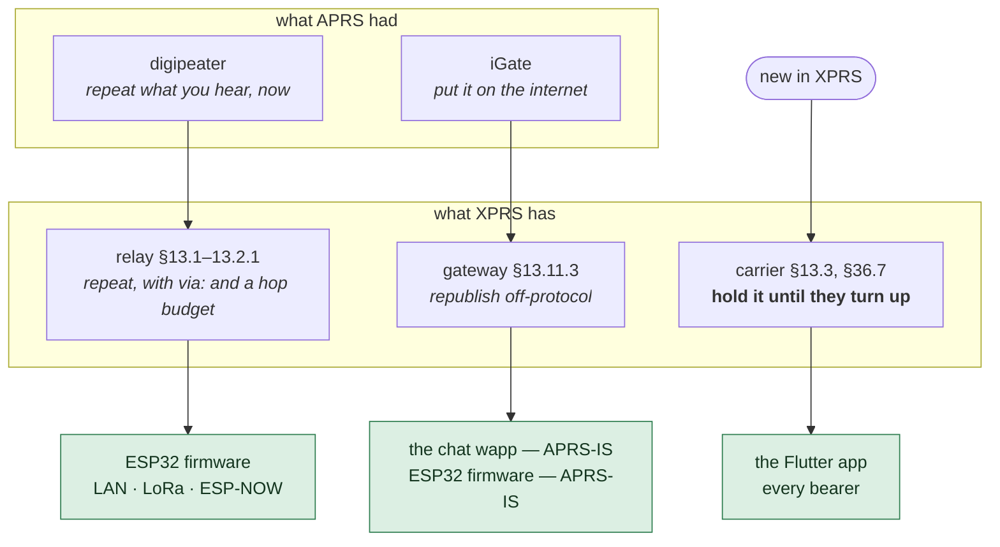
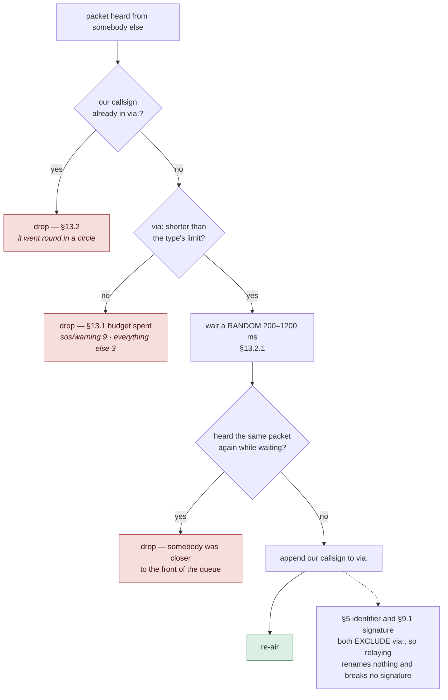
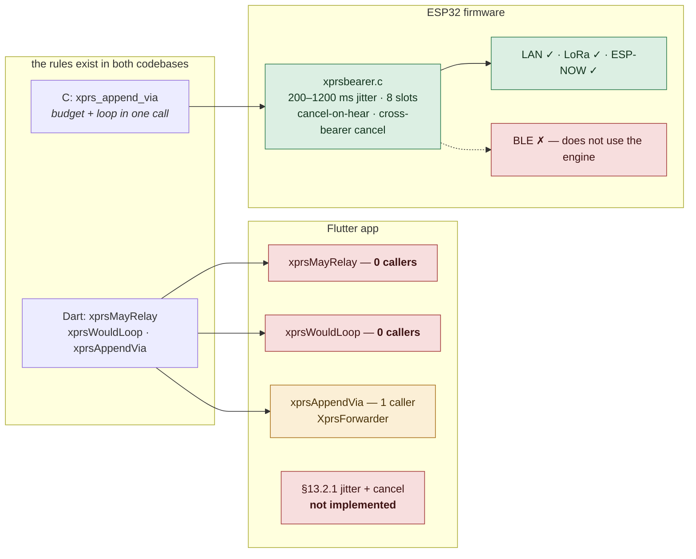
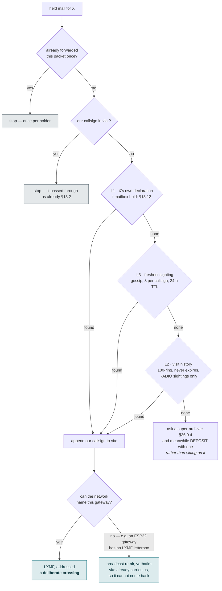
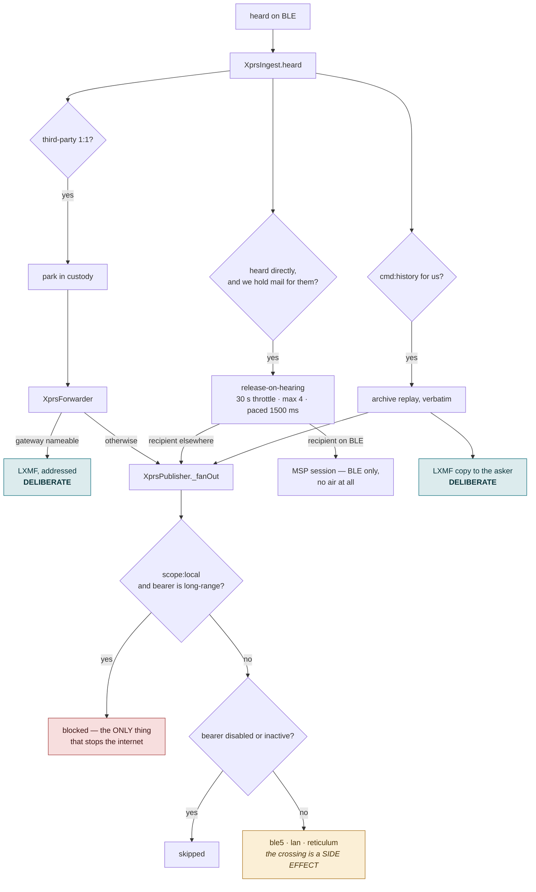
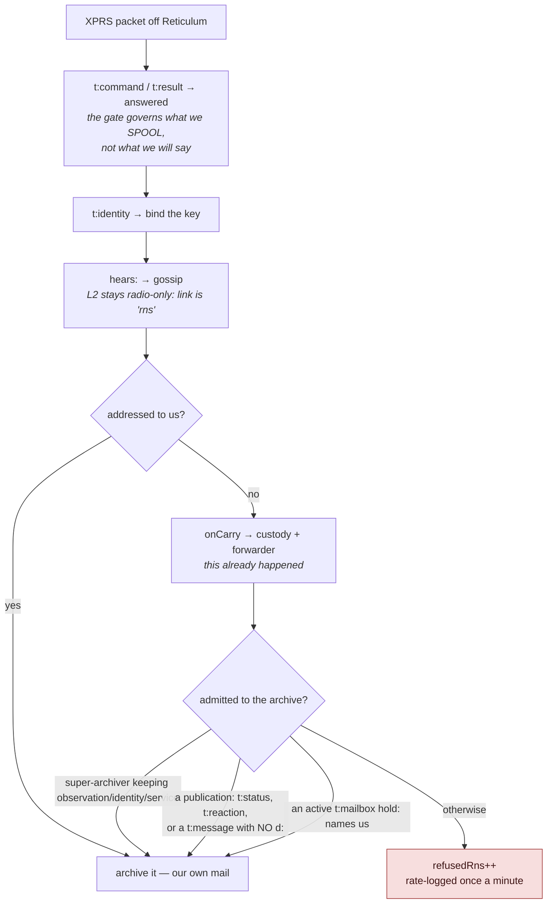

# Relay, gateway, carrier — what repeats a packet and what holds it

APRS had two roles that moved somebody else's packet: the **digipeater**, which
repeats what it hears, and the **iGate**, which puts it on the internet. XPRS
keeps both and adds a third — the **carrier**, which holds a packet for a station
that is not there.

This is where each of them actually runs, which is not where you would guess.

> `../XPRS.md` §1.1 names all three, and the distinction is load-bearing:
> a relay *"repeats a packet on the medium it heard it, within the hop budget,
> appending itself to `via:`"*; a carrier *"holds a message in custody for a
> station that is absent"*; a gateway *"republishes packets onto something that
> is not XPRS"*.

---

## Fig. 1 — The three roles, and where each one lives

The surprise is that no single piece of software does all three, and the
Flutter app — the thing most people run — does exactly one of them.



| role | in the Flutter app? | where it is |
|---|---|---|
| **relay** (digipeat) | **no** | ESP32 firmware, on LAN, LoRa and ESP-NOW |
| **carrier** (store & forward) | **yes** | `MeshStore` + `MeshCourier` + `XprsForwarder` |
| **gateway** (iGate) | **no** | the chat wapp (wasm, over the app's socket HAL) and the ESP32 |

**Nobody digipeats BLE.** The firmware's relay engine is wired into LAN, LoRa and
ESP-NOW; `xprs_bearer_ble` does not include it. The app does not relay on any
bearer. So on the busiest off-grid lane there is no digipeater at all — a packet
travels one radio hop, and everything past that is custody.

**Which is enough to bridge bearers, and does.** §36.12: *"It can cross the
internet on one hop and a LoRa hill on the next; every hop is a holder."* A
BLE-only phone reaches a LAN-only desktop because a station that hears both
takes custody and hands it on — and §36.8.1 makes that hand-off a relay in every
respect that matters: the author's bytes and signature travel untouched, `via:`
gains the carrier, and the §13.1 budget and §13.2 loop check apply. Measured:

```
sent from TANK2 (Bluetooth only), arrived at the desktop (LAN only) in under 20s
t:message f:X1VCVM d:X16JK8 ts:… sig:… via:X3ARK m:…      bearer=lan
```

`f:` is still the author (§13: *"A relay never rewrites `f:`"*), `via:` names the
carrier, and the signature still verifies because §5 and §9.1 both exclude `via:`.

Two things had to be true for that to happen automatically rather than by luck,
and neither was:

- **The carrier has to say what it hears.** The BLE beacon built `hears:` from
  `MeshTable.neighbors`, a table nothing fills, so this station had never told
  anyone who it could reach. §36.9.4's gossip resolves "who can reach X" from
  exactly that field. It now reads the monitor, like the LAN beacon.
- **And sign it.** Gossip refuses an unsigned claim outright, so a populated
  `hears:` on an unsigned beacon still fed nothing. The BLE beacon is signed
  now, with room reserved before the neighbour list is fitted.

Before: the sender's gossip named only itself as a gateway to the desktop, and
mail for it had nowhere to go but the hope that a carrier happened to overhear
the one advert.

---

## Fig. 2 — What a relay is supposed to do (§13.1, §13.2, §13.2.1)



The random wait is not politeness, it is the whole mechanism: every station in
range hears the packet in the same instant and every willing relay is ready to
transmit in the same instant. Without the jitter they collide; without the
cancel they all transmit anyway.

---

## Fig. 3 — Who implements that, and who does not



`xprsMayRelay` and `xprsWouldLoop` are **exercised only by unit tests**. The app
says so itself, and calls it a decision rather than a gap
(`lib/services/xprs/xprs_lan.dart`):

> This station does not relay. It airs what it composed and it ingests what it
> hears… a desktop is an endpoint on this bearer, and the digipeaters on the
> segment are the stations built to be one. Adding relaying here means
> implementing section 13.2.1 in full (the 200–1200 ms jitter AND the
> cancel-on-hearing), so it is a **deliberate omission rather than an oversight**.

**One deviation worth naming.** `XprsForwarder` is the single path that appends
`via:`, and it checks the loop by hand but **never checks the hop budget** —
while §36.8.1 says of exactly this hand-off that *"the section 13.1 budget and
the section 13.2 loop check apply"*. Half the rule is applied.

---

## Fig. 4 — The carrier: what XPRS adds over APRS

APRS loses a message addressed to a station that is not listening. XPRS holds it.
This is the role that has no APRS ancestor, and it is the one the app implements
fully.

```mermaid
sequenceDiagram
    autonumber
    participant S as sender
    participant H as this station<br/>(a carrier)
    participant R as recipient<br/>(not here yet)
    participant O as other custodians

    S-->>H: t:message d:R — overheard, not for us
    Note over H: §36.12.1 — the sender parked its own copy too;<br/>an airing is an ATTEMPT, not a delivery
    H->>H: park in custody §13.3<br/>bounded: 7-day TTL + byte quota, evict ORDER BY urg, ts

    Note over H,R: …hours pass. The recipient is somewhere else…

    R-->>H: any packet from R, heard DIRECTLY (no via:)
    Note over H: §36.8.1 — the trigger is the packet itself.<br/>NOT a poll: "a station that checks every ten seconds<br/>spends its battery asking a question the air already answered"
    H->>R: release held mail, on the bearer R was heard on
    R-->>H: t:receipt s:ack §13.7
    H->>H: purge our copy
    O-->>O: every OTHER holder that hears the receipt<br/>releases its copy too
```

That last line is why a receipt is worth repeating after the sender has seen it:
it is what drains a chain of custodians instead of delivering the same message
five times.

---

## Fig. 5 — Handing mail toward where the recipient actually is (§36.8.1)

Waiting is not the only option. A holder may move the mail closer while both
parties sleep.



The recipient's own word outranks every observation — this is the one place
`hold:`'s preference order is consumed rather than merely stored.

---

## Fig. 6 — How a packet crosses bearers

The question this document exists to answer: a packet arrives on Bluetooth —
what puts it on the LAN, or on the internet?

**Almost always: nothing decided to.** There are exactly three places that re-air
somebody else's packet, all of them go through the publisher, and the publisher
fans out to every active bearer.



Two crossings in the whole app are *addressed*: the forwarder's LXMF to a chosen
gateway, and the history server's LXMF copy to whoever asked. Everything else
reaches the internet because `_fanOut` puts the wire on every bearer that is up,
and `scope:local` is the only brake.

That is not necessarily wrong — §36.0 says a station that cannot tell which path
reaches the asker *"answers on every bearer it can transmit on"* — but it is
worth knowing that it is the fallback doing the work, not a routing decision.

---

## Fig. 7 — The gate on the way in from the internet (§36.3)

Radio traffic is bounded by radio range. Internet traffic is not, so the internet
lane has an admission rule the radio lanes do not.



**The asymmetry is deliberate and worth seeing on a diagram:** `refusedRns` gates
the **archive only**. By the time a packet is refused it has already been offered
to custody and already been answered as a command. Refusing to *spool* a
stranger's traffic is not refusing to *carry* it.

---

## Where this disagrees with the specification

| §  | rule | state |
|---|---|---|
| 13.1 | relay budget by packet type | **applied** on the custody hand-off — the release and `XprsForwarder` both call `xprsMayRelay` now. Still not applied to a general digipeat, because there is none |
| 13.2 | loop check | **applied** on the same two paths |
| 13.2.1 | random wait, cancel on hearing | **not implemented in the app at all**; complete in firmware for LAN, LoRa, ESP-NOW |
| 13.11.3 | a gateway treats `scope:` as binding | honoured — `scope:local` is checked in the fan-out and in the chat wapp's APRS path |
| 36.8.1 | release on hearing, forward toward a gateway, once per holder | implemented |
| 9.4.1 | no self-generated callsign onto licensed spectrum | **violated**: the ESP32 iGate computes an APRS-IS passcode for an `X3` callsign |

The last row is the one that matters outside this codebase, because it is the
only one that puts traffic somewhere a regulator cares about.
