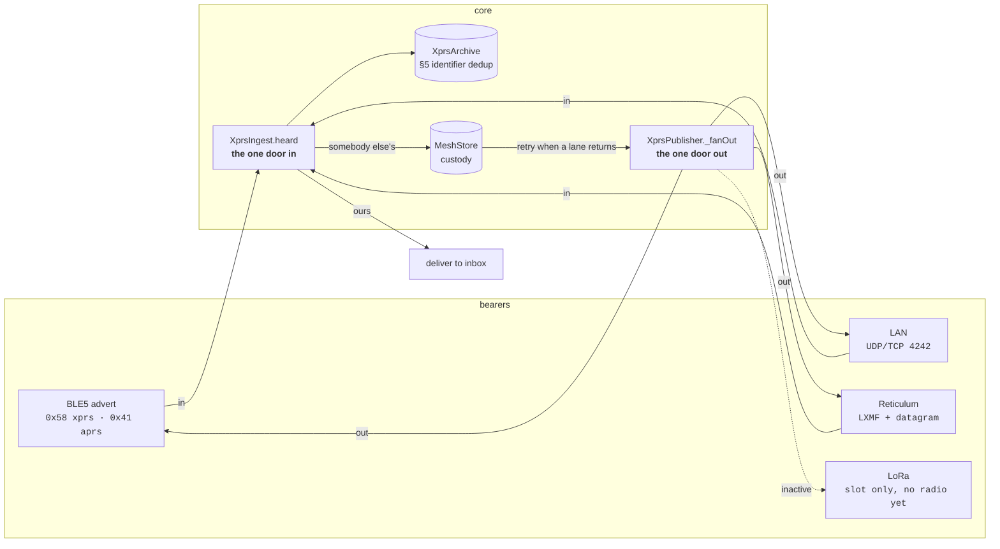
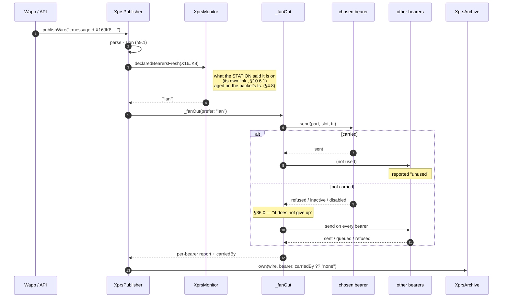
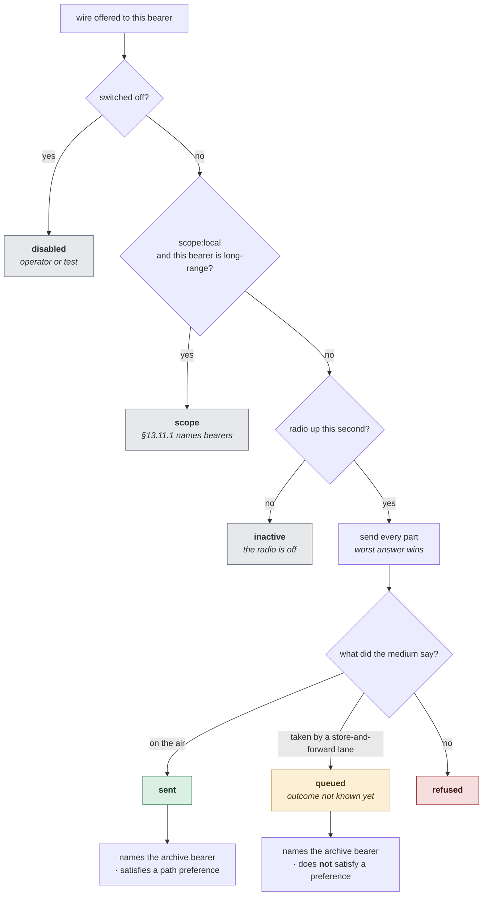
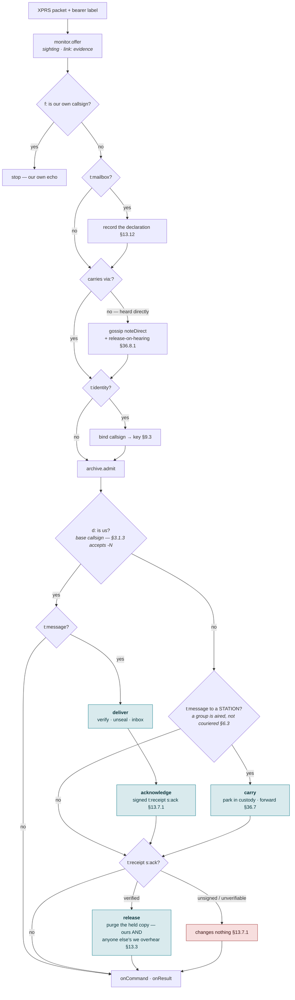
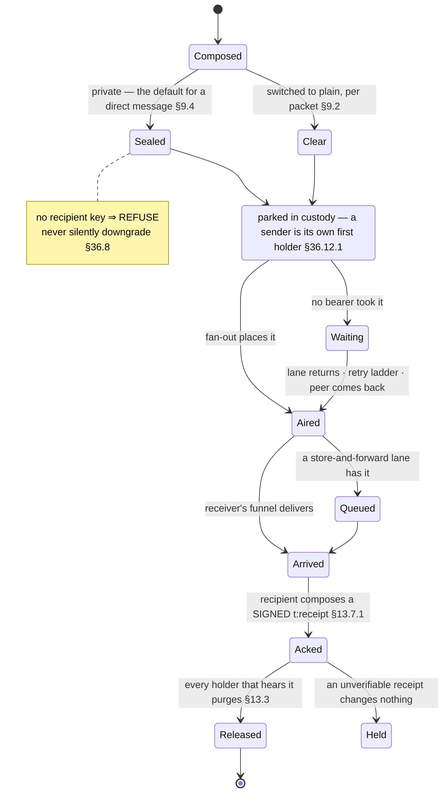

# Communication flow — diagrams

The decision flows behind [transports.md](../transports.md), drawn. Same rules, same
section references; this file is the picture and that one is the prose.

Mermaid renders on GitHub and in most editors.

---

## Fig. 1 — Where a packet enters and leaves

Four bearers, two directions, one funnel in and one fan-out out. The subtypes
matter: **XPRS airs on `0x58`**, and the custody tap that used to own carrying was
wired to `0x41`, which is how a station came to carry mail for nobody.



---

## Fig. 2 — Sending a 1:1

`§36.0` allows choosing **one** path when there is recent evidence of several to
the same station. When there is no evidence, it fans out — that is the same
section's own fallback, not a shortcut.



> A packet the fan-out could not place is still filed, under bearer `none`. A
> period where a station reached nobody is a fact worth having.

---

## Fig. 3 — What one bearer does with one wire

The four verdicts are not decoration. `disabled`, `inactive` and `refused` mean
three different things to whoever reads the report, and `queued` exists because
the report was caught calling an arriving packet `refused`.



---

## Fig. 4 — Receiving: demux, then the funnel

One owner per form. An XPRS packet goes to the funnel whatever subtype carried
it; the legacy compact frame goes to the custody tap, which is the only thing
that understands it. Both used to run for every frame.

```mermaid
sequenceDiagram
    autonumber
    participant Air as BLE5 bus
    participant Dx as subtype demux
    participant Tap as MeshCustody tap
    participant Fun as XprsIngest.heard
    participant Arc as XprsArchive
    participant Cou as MeshCourier
    participant Fwd as XprsForwarder

    Air->>Dx: frame + subtype
    alt 0x58 xprs
        Dx->>Fun: heard(packet, bearer:"ble")
    else 0x41 aprs
        Dx->>Dx: does it parse as XPRS?
        alt yes
            Dx->>Fun: heard(packet, bearer:"ble")
        else no — legacy compact frame
            Dx->>Tap: onAirFrame(inbound)
        end
    else 0x55/0x56 rns · 0x4D beacon · 0x57 wfd
        Dx->>Dx: other planes, not XPRS
    end

    Fun->>Arc: admit (queues; flush writes and drops forged)
    Arc-->>Fun: onStored → catch-up watermark
    alt addressed to us
        Fun->>Cou: onDeliver — verify, unseal, inbox
    else somebody else's 1:1
        Fun->>Cou: onCarry — park in custody
        Fun->>Fwd: maybeForward toward their mailbox
    end
```

> The watermark moves from `onStored`, not from `admit`. `admit` only queues, and
> the flush drops forged packets — so a watermark advanced at admit time stepped
> over history the station never stored.

---

## Fig. 5 — What the funnel owes an arriving packet

Every bearer enters here, so this is the only place these questions are asked.



**The carry branch is the one that was missing.** It was reached only from the
Reticulum lane, so a station carried mail that arrived over the internet and
nothing at all that arrived over a radio.

**And the receipt branch is what ends it.** Nothing composed a `t:receipt`, so a
carried copy had no terminal state — measured at 1,739 parked, 0 purged, 0
delivered. The release fires on a receipt for **anybody**, not only for us:
§13.3 has a carrier discard its copy on *overhearing* the acknowledgement, which
is the only way a chain of custodians drains instead of delivering five times.
An unverifiable one changes nothing, because §13.7.1 makes a forged `s:ack` a
way to delete a message from the whole mesh.

---

## Fig. 6 — Life of a 1:1 message



---

## Fig. 7 — Taking a lane away, on purpose

The switchboard exists because none of the fallback behaviour is observable
while four healthy bearers are up.

```mermaid
sequenceDiagram
    autonumber
    actor T as bench
    participant C61 as C61 (X3ARK)
    participant TK as TANK2 (X1VCVM)<br/>Wi-Fi off — BLE only

    T->>C61: POST /api/xprs/bearers {"disable":["ble5"]}
    T->>C61: send 1:1 to X1VCVM
    C61-->>T: ble5 disabled · lan sent · reticulum queued
    Note over C61,TK: the only lane that reaches TANK2 is gone;<br/>the copy stays parked in custody

    T->>C61: POST /api/xprs/bearers {"reset":true}
    C61->>TK: held mail moves over BLE
    TK-->>T: ingested 14 → 18
```

---

## What these diagrams do not show

The [§31.1](../XPRS.md) airtime budget, because it is not built: a station should
transmit unsolicited traffic no more often than the **strictest bearer** it is
transmitting on allows, and **a retry is not a new packet**. Both are cross-lane
rules. There are eleven independent retry schedulers and no shared budget between
them, so there is no box to draw.
